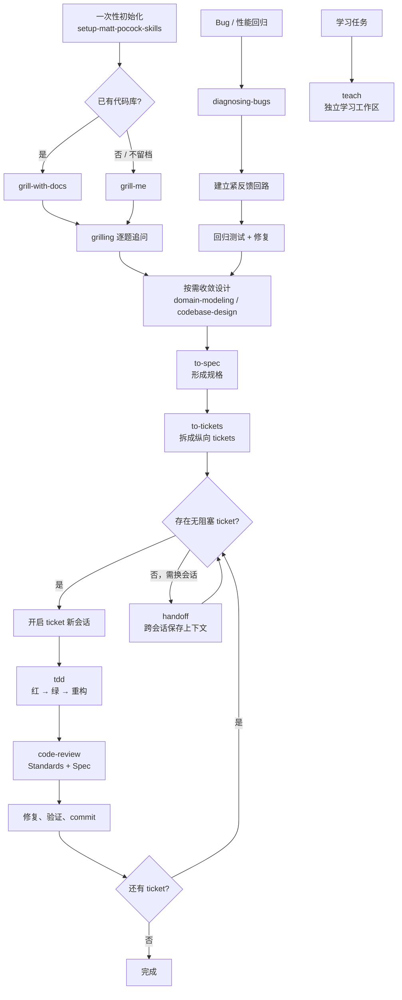

# 轻量开发工作流

本仓库采用 [mattpocock/skills](https://github.com/mattpocock/skills) 风格的精选 Skill，重点是让每一步都能独立调用，不依赖厚重的总控流程。

## 一次性初始化

在目标代码库第一次使用时调用 `setup-matt-pocock-skills`。它会根据选择配置 issue tracker、领域文档布局和标签约定。配置完成后，后续会话从当前仓库已有的 `CONTEXT.md`、ADR 和 tracker 状态继续。

## 主流程：想法到可合并变更

1. **澄清问题**：已有代码库用 `grill-with-docs`；没有代码库或不需要留下领域文档时用 `grill-me`。两者都通过 `grilling` 逐个问题推进，不在一开始假设答案。
2. **收敛设计**：遇到术语冲突或领域边界时调用 `domain-modeling`；需要决定模块形状、接口或测试 seam 时调用 `codebase-design`。
3. **形成规格**：调用 `to-spec`，把已达成的共识整理成规格，并确认测试 seam。
4. **拆成切片**：调用 `to-tickets`，生成可独立验证的纵向 ticket，并明确每个 ticket 的阻塞关系。先处理阻塞关系已经满足的 ticket。
5. **逐 ticket 实现**：每个 ticket 开一个新会话，读取 ticket 和必要的上下文后直接调用 `tdd`，按一个红—绿切片推进，不做横向批量实现。
6. **审查并提交**：ticket 完成后调用 `code-review`，分别检查仓库规范和规格符合度；修复问题、重新验证后提交，再处理下一个 ticket。
7. **跨会话衔接**：上下文需要保留但应开启新会话时调用 `handoff`。不要把半完成的实现依赖留在隐含对话记忆中。

流程图：

主流程的每个 ticket 都从 `tdd` 开始，并在 `code-review` 通过后提交；`handoff` 只负责跨会话保存上下文，不替代规格或实现。

## 分支流程

### Bug 或性能回归

从 `diagnosing-bugs` 开始。先构造一个能针对用户症状变红的紧反馈回路，再复现、最小化、提出可证伪假设，最后写回归测试并修复。若复盘发现缺少测试 seam 或模块形状不合理，转入 `codebase-design`。

### 学习而非交付

`teach` 是独立工作流：它维护 `MISSION.md`、参考资料、课程、学习记录和偏好，不应混入 feature ticket 流程。

## 取舍原则

- 不使用旧式的总控编排 Skill；ticket、TDD 和 review 是清晰的人工边界。
- 每个 ticket 必须能单独演示或验证；跨 ticket 依赖写在 ticket 中，而不是藏在会话记忆里。
- 设计和实现都以接口为测试面，优先选择高层、稳定的 seam。
- “完成”只在 review 通过、验证命令有证据、提交边界清楚时成立。
