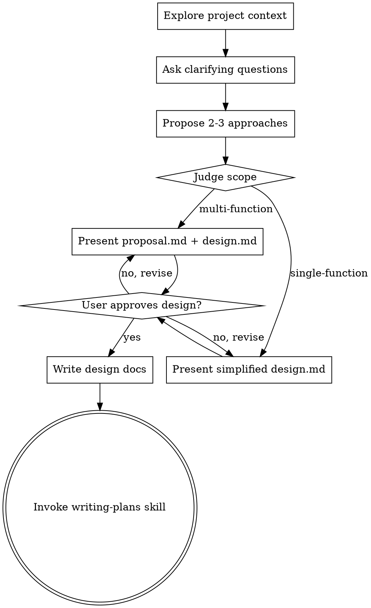

# Brainstorming Ideas Into Designs and Reviews

## Overview

Help turn ideas into fully formed designs, refine rough plans, or pressure-test existing designs through natural collaborative dialogue.

Start by selecting the right mode, then understand the current project context and ask questions one at a time. When the work is implementation-bound, present the design using SDD templates and get user approval before any implementation action.

<HARD-GATE>
Do NOT invoke any implementation skill, write any code, scaffold any project, or take any implementation action until an implementation-bound design has been presented and the user has approved it. This applies to EVERY project regardless of perceived simplicity.

Grill Mode and non-implementation review conversations may stop after a shared-understanding summary. Do not force proposal.md/design.md unless the user wants to turn the reviewed plan into implementation work.
</HARD-GATE>

## Mode Selection

Before asking substantive questions, classify the user's intent into one mode and state it briefly.

Modes:
- **Design Mode**: User has an idea or goal but no settled plan. Help shape it into options and an implementation-ready design.
- **Grill Mode**: User has an existing plan/design and wants it challenged, stress-tested, questioned, reviewed for weak assumptions, or "grilled."
- **Refinement Mode**: User has a mostly accepted design and wants targeted improvements, simplification, scope cleanup, or risk reduction.

Selection rules:
1. Explicit user intent wins.
   - "grill me", "拷问我", "压力测试", "挑刺", "反驳这个方案", "找漏洞" => Grill Mode
   - "帮我设计", "brainstorm", "想方案", "怎么做" => Design Mode
   - "优化一下", "收敛一下", "帮我改进", "简化方案" => Refinement Mode
2. If the user provides a concrete plan, architecture, PR strategy, or design draft and asks for evaluation, prefer Grill Mode.
3. If the user only provides a goal, vague idea, or desired outcome, prefer Design Mode.
4. If the mode is ambiguous and the wrong mode would materially change the conversation, ask one question: "你希望我帮你一起成型方案，还是严格压力测试已有方案？我的建议是：<mode>，因为 <reason>。"
5. User override always wins. If the user says to use or avoid a mode, follow that.

## Grill Mode

Use Grill Mode to interrogate an existing plan until the key decision tree is resolved.

Process:
1. Identify the current plan, the decision being tested, and the user's success criteria.
2. If a question can be answered by exploring the codebase, docs, or recent changes, explore that context instead of asking the user.
3. Ask one question at a time. For each question, include a recommended answer and the reasoning behind it.
4. Walk dependencies between decisions. Do not jump to unrelated topics while a branch still has unresolved assumptions.
5. Probe these areas as relevant: problem framing, users, success metrics, non-goals, system constraints, APIs/data flow, failure modes, migration/backward compatibility, security/privacy, testing, observability, rollout, and rollback.
6. Stop when the core decision, major assumptions, alternatives rejected, risks/trade-offs, and next action are explicit.

Question format:

```markdown
Question: <one focused question>

Recommended answer: <the default answer I would choose>

Why: <brief reasoning, including trade-offs>
```

Final Grill Mode output:
- **Shared Understanding** — what is now agreed
- **Resolved Decisions** — decisions made during grilling
- **Remaining Risks** — risks that still matter
- **Open Questions** — only unresolved questions that block action
- **Recommended Next Action** — continue grilling, switch to Design Mode, write docs, or stop

## Anti-Pattern: "This Is Too Simple To Need A Design"

Every implementation-bound project goes through the design gate. A todo list, a single-function utility, a config change — all of them. "Simple" projects are where unexamined assumptions cause the most wasted work. The design can be short (simplified design.md for single-function tasks), but you MUST present it and get approval before implementation.

## Scope Judgment: Single-Function vs Multi-Function

Before presenting the design, judge the scope:

```
单一功能（跳过 proposal.md，简化 design.md）:
  - 只改 1 个文件
  - 只加/改 1 个方法或功能点
  - 无架构决策（不涉及多模块交互、继承关系、数据流变更）

非单一功能（必须 proposal.md + 完整 design.md）:
  - 改 2+ 个文件
  - 涉及多个模块或组件
  - 有架构决策（继承关系、模式选择、数据流设计）
  - 有"不能动"的约束需要记录
```

**When in doubt, treat as multi-function.** Skipping proposal.md when needed costs rework; writing an unnecessary one costs 5 minutes.

## Design / Refinement Checklist

For Design Mode, and for Refinement Mode when the user wants implementation work, create a task for each of these items and complete them in order:

1. **Explore project context** — check files, docs, recent commits
2. **Ask clarifying questions** — one at a time, understand purpose/constraints/success criteria
3. **Propose 2-3 approaches** — with trade-offs and your recommendation
4. **Judge scope** — single-function or multi-function? (see Scope Judgment above)
5. **Present design** — using SDD templates, get user approval:
   - Multi-function: output proposal.md (按 @references/proposal.template.md) + design.md (按 @references/design.template.md)
   - Single-function: output simplified design.md only (Context + Goals + Non-Goals, skip Decisions and Risks)
6. **Write design docs** — save to `docs/plans/`:
   - `docs/plans/YYYY-MM-DD-<topic>-proposal.md` (multi-function only)
   - `docs/plans/YYYY-MM-DD-<topic>-design.md` (always)
   - Commit to git
7. **Transition to implementation** — invoke writing-plans skill to create tasks.md

## Design / Refinement Process Flow



**For implementation-bound Design/Refinement Mode, the terminal state is invoking writing-plans.** Do NOT invoke frontend-design, mcp-builder, or any other implementation skill. The ONLY skill you invoke after implementation-bound brainstorming is writing-plans.

**For Grill Mode, the terminal state is a shared-understanding summary unless the user explicitly asks to turn the reviewed plan into implementation work.**

## Design Mode Process

**Understanding the idea:**
- Check out the current project state first (files, docs, recent commits)
- Ask questions one at a time to refine the idea
- Prefer multiple choice questions when possible, but open-ended is fine too
- Only one question per message - if a topic needs more exploration, break it into multiple questions
- Focus on understanding: purpose, constraints, success criteria

**Exploring approaches:**
- Propose 2-3 different approaches with trade-offs
- Present options conversationally with your recommendation and reasoning
- Lead with your recommended option and explain why

## Refinement Mode Process

Use Refinement Mode when the user already has a direction and wants improvement rather than interrogation.

- Confirm what should stay fixed before suggesting changes.
- Prefer simplification, sharper non-goals, reduced scope, and clearer acceptance criteria.
- Ask one question at a time only when the answer changes the design.
- If the refined design is implementation-bound, return to the Design / Refinement Checklist and produce the appropriate SDD docs.

**Presenting the design (multi-function):**

Output two documents following the SDD templates:

**proposal.md** (按 @references/proposal.template.md):
- **Why** — one sentence on business driver
- **What Changes** — file-level change list with add/modify/delete labels
- **Capabilities** — named, independently verifiable feature units
- **Impact** — affected files, database, cache, external dependencies, downstream services

**design.md** (按 @references/design.template.md):
- **Context** — current architecture and behavior before changes
- **Goals** — what to achieve, in verifiable language
- **Non-Goals** — what NOT to do (most important section for AI boundary control)
- **Decisions** — each with "选择 + 理由", explain why alternatives were rejected
- **Risks / Trade-offs** — each with specific scenario and mitigation

Ask after each section whether it looks right so far. Be ready to go back and revise.

**Presenting the design (single-function):**

Output simplified design.md only:
- **Context** — 1-2 sentences on current state
- **Goals** — what to achieve
- **Non-Goals** — what NOT to do (still required even for simple tasks)

Skip Decisions and Risks sections.

## After an Implementation-Bound Design

**Documentation:**
- Multi-function: write both `docs/plans/YYYY-MM-DD-<topic>-proposal.md` and `docs/plans/YYYY-MM-DD-<topic>-design.md`
- Single-function: write only `docs/plans/YYYY-MM-DD-<topic>-design.md`
- Use elements-of-style:writing-clearly-and-concisely skill if available
- Commit the design document(s) to git

**Implementation:**
- Invoke the writing-plans skill to create tasks.md
- Do NOT invoke any other skill. writing-plans is the next step.

## Key Principles

- **One question at a time** - Don't overwhelm with multiple questions
- **Multiple choice preferred** - Easier to answer than open-ended when possible
- **YAGNI ruthlessly** - Remove unnecessary features from all designs
- **Explore alternatives** - Always propose 2-3 approaches before settling
- **Incremental validation** - Present design, get approval before moving on
- **Be flexible** - Go back and clarify when something doesn't make sense
- **Non-Goals are critical** - Always list what NOT to do, even for simple tasks. This prevents AI from "helpfully" doing extra work that breaks things.
- **Decisions need rationale** - Not just "chose A", but "chose A because B would cause X problem". Trap knowledge is the most valuable part of design.md.
