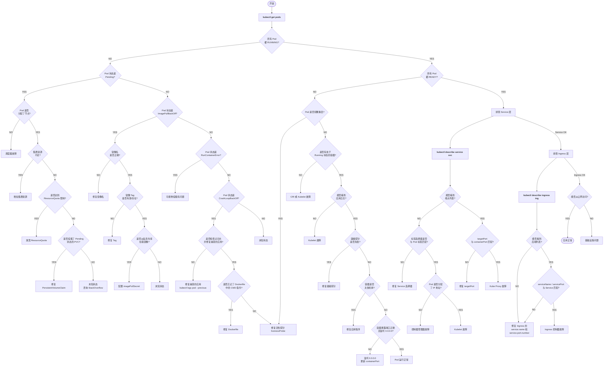

# Kubernetes 故障排查完整决策树

> 来源：[learnk8s - Troubleshooting Deployments](https://learnk8s.io/troubleshooting-deployments)

## Mermaid 流程图



## 关键命令速查

```bash
# Pod 层
kubectl get pods
kubectl get pods -o wide                       # 看 Node 和 IP
kubectl describe pod <pod>                     # 看 Events
kubectl logs <pod>                             # 当前日志
kubectl logs <pod> --previous                  # 上次崩溃的日志

# Service 层
kubectl get svc
kubectl describe service <svc>                 # 看 Endpoints
kubectl get endpoints <svc>

# Ingress 层
kubectl get ingress
kubectl describe ingress <ing>                 # 看 Backends
```
